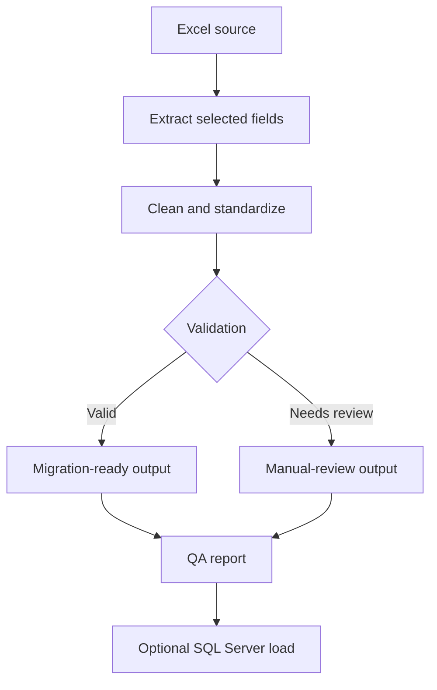

# Automated Member Data Migration and QA System

## 1. Project Overview

A production-style Python automation and QA system that extracts member
records from an Excel workbook, cleans and standardizes the data, separates
records that need human review, resolves duplicates, generates a
migration-ready dataset, and produces a detailed multi-worksheet QA report —
all backed by an automated Pytest suite.

This is an **automation and QA engineering project**, not a one-off cleaning
script: it is built around configuration, custom error handling, structured
logging, reconciliation checks, checksum-based file-integrity protection, and
a fully independent test suite using synthetic data.

## 2. Business Problem

Organizations that migrate membership data from legacy Excel exports into a
new system face a common set of problems: inconsistent headers, missing or
malformed identifiers, duplicate records, and conflicting entries under the
same ID. Manually resolving these issues is slow, error-prone, and hard to
audit. This project automates that process end-to-end and produces evidence
(a QA report and validation results) that the migration is trustworthy.

## 3. Objectives

- Extract only the required member fields from a larger, messier workbook
- Assess source-data quality with aggregate metrics
- Standardize names, member numbers, and gender values
- Detect missing required information without over-rejecting valid records
- Detect exact duplicates and repeated member numbers
- Separate genuinely conflicting records for manual review
- Produce a clean, migration-ready dataset with sequential IDs
- Produce a detailed Excel QA report with formatted worksheets
- Log every run without ever logging private record-level data
- Test the cleaning and validation logic automatically
- Support an optional, safety-gated SQL Server load
- Ship a fully synthetic public demonstration dataset

## 4. Technologies

- Python 3
- pandas
- openpyxl
- pytest
- SQLAlchemy + pyodbc (optional SQL Server load)
- python-dotenv
- Standard library: `pathlib`, `logging`, `argparse`, `datetime`, `re`,
  `hashlib`, `dataclasses`

## 5. Project Structure

```text
member-data-automation/
├── data/
│   ├── private/                  # gitignored - real data never committed
│   └── sample/
│       └── synthetic_member_data.xlsx
├── output/
│   ├── private/                  # gitignored - real outputs never committed
│   └── sample/
│       ├── cleaned_members_sample.xlsx
│       ├── manual_review_sample.xlsx
│       └── qa_report_sample.xlsx
├── src/
│   ├── config.py
│   ├── extract.py
│   ├── transform.py
│   ├── validate.py
│   ├── report.py
│   ├── sample_generator.py
│   └── database.py
├── tests/
│   ├── test_transform.py
│   ├── test_validation.py
│   └── test_reconciliation.py
├── main.py
├── requirements.txt
├── .env.example
├── .gitignore
├── LICENSE
└── README.md
```

## 6. ETL and QA Workflow



1. **Extract** — locate the correct sheet (by scoring which sheet's headers
   match the four required fields), tolerantly map irregular headers, and
   read only `original_member_no`, `member_name`, `nepali_name`, `gender`.
2. **Clean and standardize** — trim/collapse whitespace, normalize gender,
   validate member numbers, preserve Nepali Unicode.
3. **Validate** — apply missing-data rules and route records that cannot be
   safely migrated to manual review.
4. **Resolve duplicates** — remove exact duplicates, collapse same
   member-number/same-name repeats, and isolate conflicting-name groups.
5. **Generate output** — assign new sequential `member_no` values and write
   the migration-ready file.
6. **QA report** — write a seven-worksheet Excel report with formatted,
   filterable, color-coded results.
7. **Optional SQL load** — disabled by default; requires two independent
   safety switches.

## 7. Cleaning Rules

- English names: trimmed, internal whitespace collapsed, punctuation and
  capitalization preserved.
- Nepali names: Unicode preserved exactly, trimmed, never transliterated,
  nullable.
- Member numbers: valid whole numbers only; missing, non-numeric, and
  fractional values are treated as invalid; leading-zero text values are
  preserved in an audit field.
- Gender: case/whitespace-insensitive mapping of `Male/male/MALE/M/m` and
  `Female/female/FEMALE/F/f`; anything else becomes `null` in the final
  output while the original value is retained in the audit trail. Gender is
  never guessed from a name.

## 8. Duplicate-Handling Rules

- **Exact duplicates** (same member number, same normalized name, same
  Nepali name, same gender): one record kept — the most complete, tie-broken
  by earliest source row.
- **Same member number, same normalized name, differing detail** (e.g. one
  row has a Nepali name/gender and another doesn't): most complete record
  kept.
- **Same member number, conflicting names**: the *entire group* is routed to
  manual review and excluded from the migration-ready output. No automatic
  or alphabetical tie-break is applied — a human must resolve which record
  is correct.

## 9. Validation Rules

15 mandatory checks are run on every execution, including: schema
correctness, uniqueness and gap-free sequencing of `member_no`, gender
domain compliance, reconciliation of raw vs. cleaned vs. review vs.
duplicate-removed counts, existence of all output files, and a SHA-256
checksum comparison proving the original workbook was never modified.

## 10. Installation

```bash
git clone <your-repo-url>
cd member-data-automation
python -m venv .venv
source .venv/bin/activate        # Windows: .venv\Scripts\activate
pip install -r requirements.txt
```

## 11. Running Instructions

```bash
# Generate the synthetic public demonstration dataset
python main.py --generate-sample

# Run the automation on the synthetic dataset
python main.py --input "data/sample/synthetic_member_data.xlsx" --mode sample

# Run the automation on your own private workbook (never committed)
python main.py --input "data/private/source_member_data.xlsx" --mode private
```

## 12. Testing Instructions

```bash
pytest -v
```

All tests use small, entirely fictional names and numbers — no real data is
ever used in the test suite.

## 13. Output Descriptions

| File | Description |
|---|---|
| `cleaned_members.xlsx` | Migration-ready data: `member_no`, `member_name`, `nepali_name`, `gender` |
| `manual_review.xlsx` | Records needing human review, with reasons |
| `qa_report.xlsx` | 7-worksheet QA report: Summary, Missing Values, Duplicate Summary, Duplicate Details, Gender Distribution, Validation Results, Run Metadata |
| `automation.log` | UTF-8 execution log (aggregate/metadata only — never full records) |

## 14. SQL Server Integration

`src/database.py` implements an optional loader that is **disabled by
default**. Loading requires *both*:

1. The `--load-sql` command-line flag, **and**
2. `ALLOW_SQL_LOAD=true` in the environment (see `.env.example`)

The loader validates the cleaned data, runs inside a single transaction,
rolls back on any failure, and verifies the row count afterward. It never
drops/truncates tables and never hard-codes credentials. To test it safely:
point `SQL_CONNECTION_STRING` at a **development-only** database, set both
safety switches, and run `python main.py --input <file> --mode sample
--load-sql`.

## 15. Privacy and Confidentiality Statement

This system was originally built against a real, confidential member
workbook. That workbook and all record-level outputs derived from it are
excluded from version control (`data/private/`, `output/private/`, `.env`,
`*.log`). Only synthetic, fictional data and aggregate statistics are ever
included in this public repository. No original organization name or
filename appears anywhere in this project.

## 16. Synthetic-Data Explanation

`src/sample_generator.py` creates 38 fully fictional member records that
exercise every rule in the pipeline (whitespace issues, missing fields,
gender format variants, unsupported gender values, exact duplicates,
same-number/same-name duplicates, conflicting-name groups, invalid and
missing member numbers). None of the names are derived from real records.

## 17. Skills Demonstrated

- ETL pipeline design with clear separation of extract/transform/validate/report
- Defensive data cleaning (whitespace, Unicode, type coercion, malformed IDs)
- Deterministic duplicate-resolution and conflict-isolation logic
- Reconciliation-based QA (raw = cleaned + review + duplicates removed)
- Automated testing with pytest and fixture-based synthetic data
- Professional Excel reporting with openpyxl (styling, filters, freeze panes)
- Secure-by-default optional database integration (SQLAlchemy, dual-gated)
- Privacy-conscious engineering: aggregate-only logging, checksum-verified
  read-only source handling, public/private output separation

## 18. Sample Results (Synthetic Data Only)

Running the pipeline on the 38-record synthetic dataset produces:

| Metric | Value |
|---|---|
| Raw records | 38 |
| Cleaned records | 30 |
| Manual-review records | 6 |
| Duplicate rows removed | 2 |
| Reconciliation | 38 = 30 + 6 + 2 ✅ |
| Overall QA status | PASSED |

These figures come exclusively from the synthetic dataset shipped in this
repository and do not reflect any real-world data.

## 19. Future Improvements

- Configurable header-matching rules via an external mapping file
- Optional fuzzy-matching pass (with human confirmation) for near-duplicate
  names
- Web-based review UI for the manual-review queue
- Parameterized bulk-load performance tuning for very large workbooks
- CI pipeline (GitHub Actions) running `pytest` on every push

## 20. License

MIT License — see `LICENSE`. Replace `[Your Name]` in the `LICENSE` file
with your own name before publishing.
