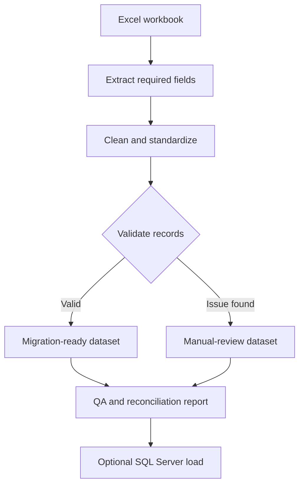

<div align="center">

# Member Data Migration & QA Automation

### Python-based ETL, data validation, reconciliation, and reporting system


**Developed by Ishika Bhattarai**

</div>

---

## Project Overview

This project automates the preparation of member records for migration from an Excel workbook to a new system. It extracts required fields, cleans and validates the data, handles duplicate records, separates uncertain records for manual review, and produces a migration-ready dataset.

The system also generates a detailed Excel QA report, verifies source-file integrity, records safe execution logs, and includes an automated test suite.

## Key Results

| Metric | Result |
|:---|---:|
| Raw sample records | **38** |
| Cleaned records | **30** |
| Manual-review records | **6** |
| Duplicate rows removed | **2** |
| Automated tests | **54 passed** |
| Reconciliation | **38 = 30 + 6 + 2** |
| Overall QA status | **PASSED** |

> These results were produced using fully synthetic demonstration data. No real member information is included in this repository.

## Main Features

- Automated Excel data extraction
- Flexible header detection and column mapping
- Data cleaning and standardization
- Nepali Unicode preservation
- Missing-value and format validation
- Duplicate detection and resolution
- Manual-review routing for conflicting records
- Sequential member ID generation
- SHA-256 source-file integrity verification
- Reconciliation-based quality assurance
- Formatted Excel QA reporting
- Automated testing with pytest
- Optional SQL Server loading
- Privacy-conscious logging and configuration

## Migration Workflow



## Technologies Used

| Technology | Purpose |
|:---|:---|
| Python 3.13 | Core automation |
| pandas | Data extraction and transformation |
| openpyxl | Excel generation and formatting |
| pytest | Automated testing |
| SQLAlchemy | Database integration |
| pyodbc | SQL Server connectivity |
| python-dotenv | Environment-based configuration |
| Git and GitHub | Version control |

## Project Structure

```text
member-data-automation/
├── data/
│   ├── private/                 # Real data excluded from Git
│   └── sample/                  # Synthetic demonstration data
├── output/
│   ├── private/                 # Private outputs excluded from Git
│   └── sample/                  # Demonstration outputs
├── src/
│   ├── config.py                # Configuration and paths
│   ├── extract.py               # Excel and column extraction
│   ├── transform.py             # Cleaning and standardization
│   ├── validate.py              # Validation and duplicate handling
│   ├── report.py                # Excel QA reporting
│   ├── sample_generator.py      # Synthetic data generation
│   └── database.py              # Optional SQL Server loading
├── tests/
│   ├── test_transform.py
│   ├── test_validation.py
│   └── test_reconciliation.py
├── main.py                      # Main command-line program
├── requirements.txt
├── .env.example
├── .gitignore
├── LICENSE
└── README.md
```

## Data-Cleaning Rules

- Leading and trailing spaces are removed.
- Repeated internal spaces are reduced to one space.
- Original name punctuation and capitalization are preserved.
- Nepali names remain in Unicode and are never transliterated.
- Member numbers must be valid whole numbers.
- Missing, non-numeric, and fractional member numbers are rejected.
- Supported gender formats are standardized to `Male` or `Female`.
- Unsupported gender values become `null`.
- Gender is never guessed from a person’s name.

## Duplicate-Handling Rules

| Situation | Action |
|:---|:---|
| Exact duplicate | Keep one record and remove the additional row |
| Same number and same name | Keep the most complete record |
| Same number with conflicting names | Move the entire group to manual review |

Conflicting names are not resolved automatically because an arbitrary selection could retain an incorrect record.

## Validation and Reconciliation

The program performs 15 validation checks during each execution, including:

- Output schema verification
- Required-field checks
- Member-number uniqueness
- Sequential ID verification
- Gender-domain validation
- Output-file existence checks
- Raw-to-output reconciliation
- Source-file checksum comparison

The main reconciliation rule is:

```text
Raw records = Cleaned records + Manual-review records + Duplicates removed
```

## Installation

### 1. Clone the repository

```powershell
git clone https://github.com/Ishika-user/member-data-automation.git
cd member-data-automation
```

### 2. Create a virtual environment

```powershell
py -3.13 -m venv .venv
```

### 3. Activate the environment

```powershell
.\.venv\Scripts\Activate.ps1
```

### 4. Install the requirements

```powershell
python -m pip install -r requirements.txt
```

## Running the Automation

### Generate synthetic sample data

```powershell
python main.py --generate-sample
```

### Run the sample migration workflow

```powershell
python main.py --input "data/sample/synthetic_member_data.xlsx" --mode sample
```

### Run with a private workbook

```powershell
python main.py --input "data/private/source_member_data.xlsx" --mode private
```

## Automated Testing

Run the complete test suite:

```powershell
python -m pytest -v
```

Successful test result:

```text
54 passed
```

The tests cover:

- Header mapping
- Data extraction
- Text cleaning
- Nepali Unicode preservation
- Member-number validation
- Gender standardization
- Duplicate handling
- Reconciliation
- Checksum verification
- Output-file validation

## Generated Outputs

| Output file | Description |
|:---|:---|
| `cleaned_members.xlsx` | Cleaned records ready for migration |
| `manual_review.xlsx` | Records requiring human verification |
| `qa_report.xlsx` | QA summary, missing values, duplicates, gender distribution, validation results, and run information |
| `automation.log` | Safe execution log containing aggregate information only |

## SQL Server Integration

SQL Server loading is optional and disabled by default. Loading requires both:

1. The `--load-sql` command-line option
2. `ALLOW_SQL_LOAD=true` in the environment settings

```powershell
python main.py --input "data/sample/synthetic_member_data.xlsx" --mode sample --load-sql
```

The loader validates the cleaned data, uses a database transaction, rolls back on failure, and verifies the inserted row count.

## Privacy and Security

The following files and folders are excluded from version control:

```text
.env
data/private/
data/sample/*.xlsx
output/
*.log
```

Only source code, tests, documentation, and synthetic information are included publicly. Real member information and database credentials are never committed.

## Problem Solving

During the first execution, Windows Application Control blocked a Pandas DLL under Python 3.14. The issue was resolved by:

1. Installing Python 3.13.14
2. Creating a new virtual environment
3. Reinstalling the required packages
4. Testing Python, NumPy, and Pandas
5. Running the automation again

After the environment was corrected, the migration workflow completed successfully and all 54 automated tests passed.

## Skills Demonstrated

- Python automation
- ETL pipeline development
- Excel data processing
- Data cleaning and validation
- Duplicate handling
- Reconciliation-based QA
- Automated testing
- SQL Server integration
- Error investigation and troubleshooting
- Git and GitHub version control
- Data privacy and secure configuration

## Future Improvements

- Configurable column-mapping rules
- Human-approved fuzzy matching for similar names
- Web-based manual-review interface
- Performance improvements for larger workbooks
- GitHub Actions for automatic testing

## License

This project is available under the [MIT License](LICENSE).

---

<div align="center">

### Member Data Migration & QA Automation

Reliable, auditable, and privacy-conscious data processing with Python.

</div>
